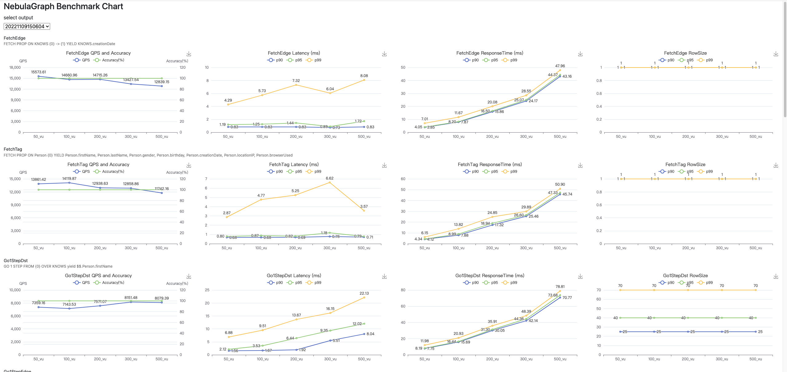

# NebulaGraph Bench

[中文文档](README_cn.md)

`NebulaGraph Bench` is a tool to test the NebulaGraph benchmark by using [LDBC](https://ldbc.github.io/) dataset.

Currently, we use ldbc_snb_datagen [v0.3.3](https://github.com/ldbc/ldbc_snb_datagen_spark/tree/v0.3.3).
It only support NebulaGraph 2.0+ release.

The main features:

* Generate the LDBC dataset and then import into NebulaGraph.
* Run load test with k6.

## Dependency

> ⚠️ Please note, the [NebulaGraph Importer](https://github.com/vesoft-inc/nebula-importer) being used by NebulaGraph Bench is [v3.x](https://github.com/vesoft-inc/nebula-importer/releases/tag/v3.4.0), the lastest branch of Importer [v4.x](https://github.com/vesoft-inc/nebula-importer/releases/tag/v4.0.0) is not yet supported.

|   NebulaGraph Bench    |     NebuaGraph     | NebulaGraph Importer |   K6 Plugin  |   ldbc_snb_datagen  |   NebulaGraph go    |
|:-----------------:|:-------------:|:---------------:|:------------:|:-------------------:|:--------------:|
|       [v0.2](https://github.com/vesoft-inc/nebula-bench/releases/tag/v0.2)        |    [v2.0.1](https://github.com/vesoft-inc/nebula-graph/releases/tag/v2.0.1)     |     [v2.0.0-ga](https://github.com/vesoft-inc/nebula-importer/releases/tag/v2.0.0-ga)   |    [v0.0.6](https://github.com/vesoft-inc/k6-plugin/releases/tag/v0.0.6)    |       [v0.3.3](https://github.com/ldbc/ldbc_snb_datagen_spark/tree/v0.3.3)        |     [v2.0.0-ga](https://github.com/vesoft-inc/nebula-go/releases/tag/v2.0.0-ga)  |
|       [v1.0.0](https://github.com/vesoft-inc/nebula-bench/releases/tag/v1.0.0)      |    [v2.5.0](https://github.com/vesoft-inc/nebula-graph/releases/tag/v2.5.0) / [v2.5.1](https://github.com/vesoft-inc/nebula-graph/releases/tag/v2.5.1)    |     [v2.5.1](https://github.com/vesoft-inc/nebula-importer/releases/tag/v2.5.1)      |    [v0.0.7](https://github.com/vesoft-inc/k6-plugin/releases/tag/v0.0.7)    |       [v0.3.3](https://github.com/ldbc/ldbc_snb_datagen_spark/tree/v0.3.3)         |     [v2.5.1](https://github.com/vesoft-inc/nebula-go/releases/tag/v2.5.1)     |
|       [v1.0.0](https://github.com/vesoft-inc/nebula-bench/releases/tag/v1.0.0)      |    [v2.6.0](https://github.com/vesoft-inc/nebula/releases/tag/v2.6.0) / [v2.6.1](https://github.com/vesoft-inc/nebula/releases/tag/v2.6.1) / [v2.6.2](https://github.com/vesoft-inc/nebula/releases/tag/v2.6.2)    |     [v2.6.0](https://github.com/vesoft-inc/nebula-importer/releases/tag/v2.6.0)      |    [v0.0.8](https://github.com/vesoft-inc/k6-plugin/releases/tag/v0.0.8)    |      [v0.3.3](https://github.com/ldbc/ldbc_snb_datagen_spark/tree/v0.3.3)         |     [v2.6.0](https://github.com/vesoft-inc/nebula-go/releases/tag/v2.6.0)     |
|       [v1.1.0](https://github.com/vesoft-inc/nebula-bench/releases/tag/v1.1.0)      |    [v3.0.0](https://github.com/vesoft-inc/nebula/releases/tag/v3.0.0) /  [v3.0.1](https://github.com/vesoft-inc/nebula/releases/tag/v3.0.1) |     [v3.0.0](https://github.com/vesoft-inc/nebula-importer/releases/tag/v3.0.0)      |    [v0.0.9](https://github.com/vesoft-inc/k6-plugin/releases/tag/v0.0.9)    |        [v0.3.3](https://github.com/ldbc/ldbc_snb_datagen_spark/tree/v0.3.3)        |     [v3.0.0](https://github.com/vesoft-inc/nebula-go/releases/tag/v3.0.0)     |
|       [v1.2.0](https://github.com/vesoft-inc/nebula-bench/releases/tag/v1.2.0)      |    [v3.1.0](https://github.com/vesoft-inc/nebula/releases/tag/v3.1.0)     |     [v3.1.0](https://github.com/vesoft-inc/nebula-importer/releases/tag/v3.1.0)      |    [v1.0.0](https://github.com/vesoft-inc/k6-plugin/releases/tag/v1.0.0)    |        [v0.3.3](https://github.com/ldbc/ldbc_snb_datagen_spark/tree/v0.3.3)        |     NONE       |
|       master      |    nightly    |     [v3.2.0](https://github.com/vesoft-inc/nebula/releases/tag/v3.2.0)      |    [v1.1.6](https://github.com/vesoft-inc/k6-plugin/releases/tag/v1.1.6)    |     [v0.3.3](https://github.com/ldbc/ldbc_snb_datagen_spark/tree/v0.3.3)      |     NONE       |

## How to use

### prepare

#### Centos7

```bash
sudo yum install -y git \
                    make \
                    file \
                    libev \
                    libev-devel \
                    gcc \
                    wget \
                    python3 \
                    python3-devel \
                    java-1.8.0-openjdk \
                    maven 

```

#### Ubuntu

```bash
sudo apt-get install -y \
     git \
     wget \
     python3-pip \
     python \
     openjdk-8-jdk \
     maven 

export JAVA_HOME=/usr/lib/jvm/default-java/
```

```bash
git clone https://github.com/vesoft-inc/nebula-bench.git 
cd nebula-bench
pip3 install --user -r requirements.txt
python3 run.py --help
```

prepare NebulaGraph tools.

* [nebula-importer](https://github.com/vesoft-inc/nebula-importer)
* [xk6-nebula](https://github.com/vesoft-inc/k6-plugin)

```bash
./scripts/setup.sh
```

After compilation, it would put binaries in `scripts` folder.

### generate ldbc data

```bash
python3 run.py data 
```

It would download the Hadoop automatically, build the datagen jar, and then generate ldbc data.

To import the data more easier, split the file header to a `header.csv` file.
The result files in `${PWD}/target/data/test_data/`

More information

```bash
# generate sf10 ldbc data
python3 run.py data  -s 10

# change hadoop options
export HADOOP_CLIENT_OPTS="-Xmx8G"
python3 run.py data -s 100

# or
# only generate, do not split the data
python3 run.py data -og
# split data, no need generate again.
python3 run.py data -os
```

### import data into NebulaGraph

```bash
python3 run.py nebula importer
```

Render the import config file according to the header files, and then run nebula-importer.

```bash
# after prepare the data, you could import the data to any NebulaGraph as you want.
# space is mytest, graph address is 127.0.0.1:9669
python3 run.py nebula importer -s mytest -a 127.0.0.1:9669

# or using dotenv
cp env .env
# vi .env
python3 run.py nebula importer

# dry run, just create the import config file, and you can modify any configuration.
# by default, PARTITION_NUM is 24,REPLICA_FACTOR is 3.
python3 run.py nebula importer --dry-run
```

### NebulaGraph benchmark

Use [k6](https://github.com/k6io/k6) with [xk6-nebula](https://github.com/HarrisChu/xk6-nebula) extension.

Scenarios are in `nebula_bench/scenarios/`.

```bash
# show help
python3 run.py stress run --help

# run all scenarios with 100 virtual users, every scenario lasts 60 seconds.
python3 run.py stress run 

# run all scenarios with 10 virtual users, every scenario lasts 3 seconds.
python3 run.py stress run --args='-u 10 -d 3s'

# list all stress test scenarios
python3 run.py stress scenarios

# run go.Go1Step scenarios with 10 virtual users, every scenario lasts 3 seconds.
python3 run.py stress run -scenario go.Go1StepEdge --args='-u 10 -d 3s'

# run go.Go1Step scenarios with special test stage.
# ramping up from 0 to 10 vus in first 10 seconds, then run 10 vus in 30 seconds, 
# then ramping up from 10 to 50 vus in 10 seconds.
python3 run.py stress run -scenario go.Go1StepEdge --args='-s 10s:10 -s 30s:10 -s 10s:50'

# use csv output
python3 run.py stress run -scenario go.Go1StepEdge --args='-s 10s:10 -s 30s:10 -s 10s:50 -o csv=test.csv'
```

for more k6 args, please refer to k6 run help.

```bash
scripts/k6 run --help
```

k6 config file, summary result and outputs are in `output` folder. e.g.

```bash
# you should install jq to parse json.
# how many checks
jq .metrics.checks output/result_Go1Step.json

# summary latency
jq .metrics.latency output/result_Go1Step.json

# summary error message 
awk -F ',' 'NR>1{print $NF}' output/output_Go1Step.csv |sort|uniq -c
```

or, just review the summary result in stdout. e.g.

```bash
     ✓ IsSucceed

     █ setup

     █ teardown

     checks...............: 100.00% ✓ 113778      ✗ 0
     data_received........: 0 B     0 B/s
     data_sent............: 0 B     0 B/s
     iteration_duration...: min=747.84µs avg=52.76ms      med=40.77ms max=1.17s   p(90)=98.68ms p(95)=147.15ms  p(99)=263.03ms
     iterations...........: 113778  1861.550127/s
     latency..............: min=462      avg=49182.770298 med=37245   max=1160358 p(90)=93377   p(95)=142304.15 p(99)=258465.89
     responseTime.........: min=662      avg=52636.793537 med=40659   max=1177651 p(90)=98556.5 p(95)=147036.15 p(99)=262869.63
     rowSize..............: min=0        avg=9.212424    med=3      max=243   p(90)=25     p(95)=40      p(99)=70
     vus..................: 100     min=0         max=100
     vus_max..............: 100     min=100       max=100
```

* `checks`, one check per iteration, verify `isSucceed` by default.
* `data_received` and `data_sent`, used by HTTP requests, useless for NebulaGraph.
* `iteration_duration`, time consuming for every iteration.
* `latency`, time consuming in NebulaGraph server, unit: (us).
* `responseTime`, time consuming in client, unit: (us).
* `rowSize`, response row size.
* `vus`, concurrent virtual users.

In general

iteration_duration = responseTime + (time consuming for read data from csv)

responseTime = latency + (time consuming for network) + (client decode)

As one iteration has one check, it means run `113778` queries.

The unit of latency is `us`.

### Report

```bash
# generate the `report.html` with summary json file in `output/20221109140449` folder.
python3 run.py report export -f output/20221109140449

# export to a new file.
python3 run.py report export -f output/20221109140449 -o new_report.html

# launch a http server with port 5050, and could browser all result in `output` folder.
python3 run.py report serve -p 5050
```



## and more

* The file with `aaa_xxYY_bbb` format, like `comment_hasTag_tag`, should be an edge, and the edge name shoud be `XX_YY`. Keep the same format with [ldbc_snb_interactive](https://github.com/ldbc/ldbc_snb_interactive/blob/main/cypher/queries/interactive-complex-1.cypher)
* Otherwise it should be a vertex tag.
* Different entity types might have same ID (e.g. Forum and Post).

LDBC schema

```bash
CREATE TAG IF NOT EXISTS `Post`(`imageFile` string,`creationDate` datetime,`locationIP` string,`browserUsed` string,`language` string,`content` string,`length` int);
CREATE TAG IF NOT EXISTS `Tag`(`name` string,`url` string);
CREATE TAG IF NOT EXISTS `Tagclass`(`name` string,`url` string);
CREATE TAG IF NOT EXISTS `Organisation`(`type` string,`name` string,`url` string);
CREATE TAG IF NOT EXISTS `Place`(`name` string,`url` string,`type` string);
CREATE TAG IF NOT EXISTS `Person`(`firstName` string,`lastName` string,`gender` string,`birthday` string,`creationDate` datetime,`locationIP` string,`browserUsed` string);
CREATE TAG IF NOT EXISTS `Forum`(`title` string,`creationDate` datetime);
CREATE TAG IF NOT EXISTS `Comment`(`creationDate` datetime,`locationIP` string,`browserUsed` string,`content` string,`length` int);
CREATE EDGE IF NOT EXISTS `HAS_CREATOR`();
CREATE EDGE IF NOT EXISTS `REPLY_OF`();
CREATE EDGE IF NOT EXISTS `STUDY_AT`(`classYear` int);
CREATE EDGE IF NOT EXISTS `WORK_AT`(`workFrom` int);
CREATE EDGE IF NOT EXISTS `HAS_MODERATOR`();
CREATE EDGE IF NOT EXISTS `LIKES`(`creationDate` datetime);
CREATE EDGE IF NOT EXISTS `HAS_MEMBER`(`joinDate` datetime);
CREATE EDGE IF NOT EXISTS `IS_PART_OF`();
CREATE EDGE IF NOT EXISTS `CONTAINER_OF`();
CREATE EDGE IF NOT EXISTS `HAS_INTEREST`();
CREATE EDGE IF NOT EXISTS `IS_SUBCLASS_OF`();
CREATE EDGE IF NOT EXISTS `HAS_TAG`();
CREATE EDGE IF NOT EXISTS `IS_LOCATED_IN`();
CREATE EDGE IF NOT EXISTS `HAS_TYPE`();
CREATE EDGE IF NOT EXISTS `KNOWS`(`creationDate` datetime);
CREATE TAG INDEX IF NOT EXISTS `person_first_name_idx` on `Person`(firstName(10));
CREATE EDGE INDEX IF NOT EXISTS `like_creationDate_idx` on `LIKES`(creationDate);
```
