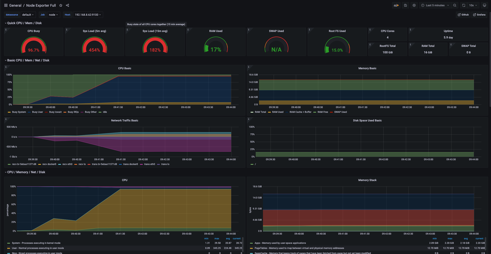
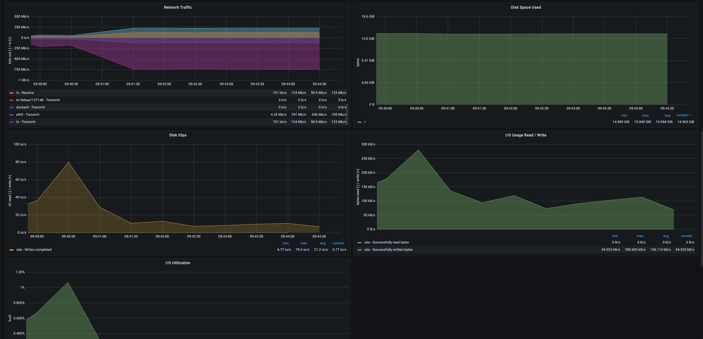
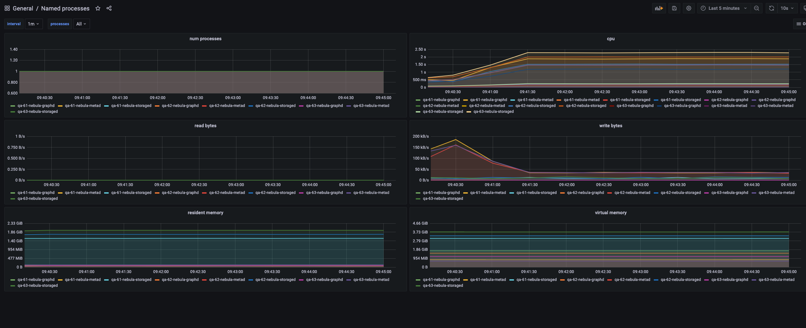
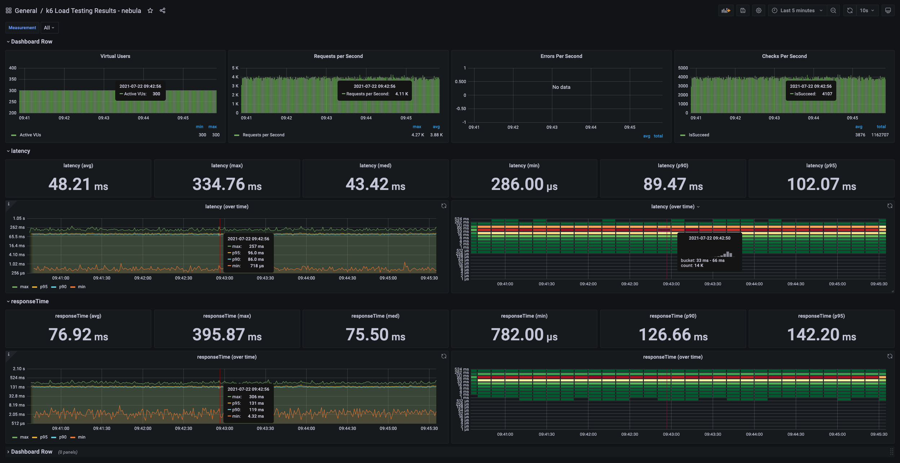

# Monitor Readme

在压测过程中，监控是不可少的环节，监控可以帮助我们：

1. 根据不同的监控结果，印证推测，不断调整测试方案。
2. 将更详尽的过程结果记录，方便报告和总结。

## 监控类型

总体上有服务端监控和客户端监控。

### 服务端监控

组件使用

* Promethues
* Node exporter
* Process exporter

### 客户端监控

组件使用

* Node exporter
* Influxdb，用来收集 qps、latency、response time 等数据。

## 部署步骤

### Promethues

* 将 promethues 复制到任意一个节点
* prometheus.yml 中，设置要监控的 nebula 节点，默认 node exporter 端口 9100，process exporter 端口 9256，然后启动 docker-compose。

```bash
docker-compose up -d
```

默认 promethues 的数据保留 15 天，如果需要更改，请自行修改 docker-compose 中 `--storage.tsdb.retention=15d'` 配置。

### Exporter

* 分别在 nebula 节点，执行压测的机器上，复制 exporter 目录。
* 修改 `filename.yml` 中的 name，方便和其他机器做区分，然后启动 docker-compose。

```bash
docker-compose up -d
```

### Grafana

为了方便，grafana 默认放在 promethues 的 docker-compose.yml 中，启动 prometheus 时，会自动启动。

* 登录 grafana，默认端口 3000，用户名/密码是: admin/admin。
* 添加 prometheus 数据源。
* import dashboard。
  * `249` process exporter
  * `1860` node exporter

### InfluxDB

为了方便，influxdb 默认放在 promethues 的 docker-compose.yml 中，启动 prometheus 时，会自动启动。

* 执行命令新建一个 influxdb 的数据库，`docker exec -it influxdb influx -execute "create database k6"`
* 在 `.env` 中，配置 influxdb 的地址，如：`http://192.168.8.60:8086/k6`。
* 登录 grafana，添加 influxdb 数据源。
* 添加 dashboard，json 文件见 [k6_influxdb.json](./promethues/k6_influxdb.json)。
* 执行压力测试，查看 grafana 的图。

## 效果

### node exporter




### process exporter



### k6 testing results


